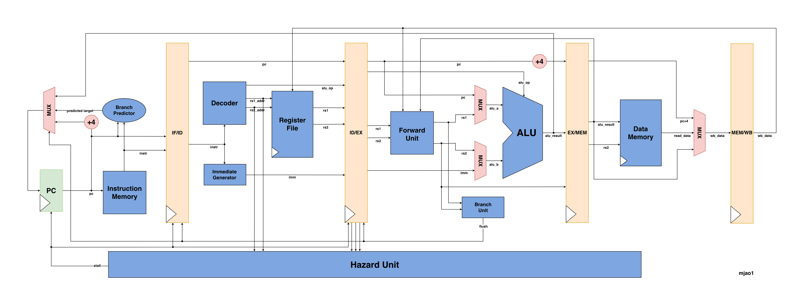
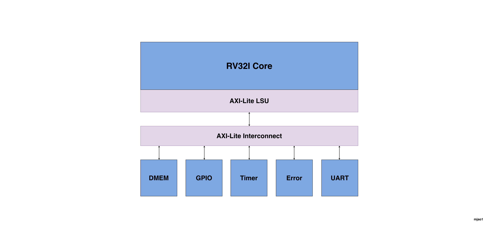

# rv32i-soc

## Project Overview

A synthesizable RISC-V RV32I **SoC** in SystemVerilog: a 5-stage pipelined CPU, AXI-Lite interconnect, and memory-mapped slaves (data RAM, GPIO, UART, timer, error target). Simulation targets Icarus Verilog and ASIC-style flows. The included **rv32i_cpu** implements the main RV32I user-level integer operations: ALU ops, loads/stores, branches, jumps, LUI/AUIPC, and JAL/JALR. The pipeline is complete for a classic in-order design: operand forwarding from EX/MEM and MEM/WB, hazard handling via load–use stalls, BTFNT branch prediction, and control flushes on taken branches and jumps. Instruction memory is loaded via a testbench write port or `$readmemh`; loads and stores in SoC mode reach the bus through `dmem_axi_lite_master`, while standalone CPU simulations use on-chip `data_memory`. The CPU microarchitecture is shown below (most address and control signals are omitted for simplicity).

<div align="center">

<p>CPU Microarchitecture</p>
</div>

<div align="center">

<p>SoC Microarchitecture</p>
</div>

## Architecture Overview

- **SoC / bus:** `rv32i_soc` ties `rv32i_cpu` with `EXT_DMEM` to `dmem_axi_lite_master`, `axi_lite_interconnect`, and AXI-Lite slaves (data RAM, GPIO, UART, timer, decode-miss error).
- **5-stage pipeline:** IF, ID, EX, MEM, WB with forwarding, load–use stalls, and branch/JAL flush.
- **PC:** Registered; next PC is sequential (`PC+4`), held on stall, or branch/jump target from EX.
- **Register file:** 32 × 32-bit, dual read, one write; x0 always reads as 0.
- **ALU:** Add/sub, shifts, compares, bitwise ops; shared for addresses and branch targets.
- **Memories:** Instruction memory (word-oriented fetch); data either internal `data_memory` (CPU-only) or AXI-backed RAM in SoC mode.

## Project Structure

```
rv32i-soc/             
├── rtl/
│   ├── alu.sv
│   ├── axi_lite_dmem_slave.sv
│   ├── axi_lite_err_slave.sv
│   ├── axi_lite_gpio_slave.sv
│   ├── axi_lite_interconnect.sv
│   ├── axi_lite_timer_slave.sv
│   ├── axi_lite_uart_slave.sv
│   ├── axi4_lite_pkg.sv
│   ├── branch_predictor.sv
│   ├── branch_unit.sv
│   ├── data_memory.sv
│   ├── decoder.sv
│   ├── dmem_axi_lite_master.sv  # AXI-Lite LSU
│   ├── forward_unit.sv          # EX operand forwarding
│   ├── hazard_unit.sv           # Load–use stall detection
│   ├── immediate_generator.sv
│   ├── instruction_memory.sv
│   ├── register_file.sv
│   ├── rv32i_cpu.sv             # CPU top level
│   ├── rv32i_pkg.sv             # Shared types (alu_op_t, branch_op_t, result_src_t)
│   └── rv32i_soc.sv             # SoC (CPU + interconnect + peripherals)
├── sim/
│   ├── tb_alu.sv
│   ├── tb_axi_lite_interconnect.sv
│   ├── tb_branch_benchmark.sv
│   ├── tb_branch_unit.sv
│   ├── tb_data_memory.sv
│   ├── tb_decoder.sv
│   ├── tb_forward_unit.sv
│   ├── tb_hazard_unit.sv
│   ├── tb_immediate_generator.sv
│   ├── tb_instruction_memory.sv
│   ├── tb_load_use_hazard.sv
│   ├── tb_register_file.sv
│   ├── tb_rv32i_cpu_c.sv        # C program (internal DMEM)
│   ├── tb_rv32i_cpu.sv          # CPU smoke test
│   ├── tb_rv32i_soc_c.sv        # C program (AXI DMEM)
│   └── tb_rv32i_soc.sv          # SoC smoke test
└── test/
    ├── programs/                # *.mem / *.hex images for simulation
    └── software/                # Bare metal C, linker script, Makefile
```

## RTL Implementation

### SoC

- **rv32i_soc:** Top-level SoC; instantiates `rv32i_cpu` (`EXT_DMEM`), `dmem_axi_lite_master`, `axi_lite_interconnect`, and ties off GPIO inputs, UART RX/TX, and debug PC.
- **dmem_axi_lite_master:** AXI4-Lite **master** (LSU): single in-flight load or store driven from the EX/MEM snapshot (`fmt_load` / store strobes aligned with `data_memory.sv`).
- **axi_lite_interconnect:** AXI4-Lite **interconnect**: one master port; address decode and routing to DMEM, GPIO, UART, timer, or error slave; write target latched on AW so W may follow later.
- **axi_lite_dmem_slave:** AXI4-Lite **slave**; byte RAM backing the main data port (`ADDR_BASE`/`MEM_BYTES`); read/write channels with OKAY responses.
- **axi_lite_gpio_slave:** AXI4-Lite **slave**; memory-mapped GPIO data and direction per bit, synchronized inputs.
- **axi_lite_uart_slave:** AXI4-Lite **slave**; TX/RX data and status (TXE, RXNE, busy, overrun), divisor for baud rate.
- **axi_lite_timer_slave:** AXI4-Lite **slave**; counter, reload, and enable used as a simple memory-mapped timer.
- **axi_lite_err_slave:** AXI4-Lite **slave**; responds with **SLVERR** on decode misses (addresses that hit no other slave).
- **axi4_lite_pkg:** Package with shared AXI4-Lite response codes (`RESP_OKAY`, `RESP_SLVERR`, etc.).

### CPU and datapath

- **rv32i_cpu:** Pipeline registers, forward_unit, hazard_unit, PC, instruction fetch, decode, register file, ALU, branch unit, WB to regfile. Includes internal `data_memory` when `EXT_DMEM` is off, and stall/response hooks for external DMEM when `EXT_DMEM` is on.
- **forward_unit:** Selects ALU `rs1`/`rs2` from ID/EX, EX/MEM (non-load), or MEM/WB.
- **hazard_unit:** Asserts stall when a load in EX/MEM supplies a register needed by the instruction in EX.
- **decoder:** Decodes RV32I opcode/funct fields into ALU operation, source selects, reg write, mem write, branch type, and register addresses.
- **alu:** Combinational ALU (`ADD`, `SUB`, `AND`, `OR`, `XOR`, `SLT`, `SLTU`, `SLL`, `SRL`, `SRA`).
- **register_file:** 32 registers; asynchronous read, synchronous write; x0 write discarded.
- **immediate_generator:** Builds sign-extended immediates for I/S/B/U/J formats.
- **branch_unit:** Branch condition evaluation from `funct3` and comparison inputs.
- **branch_predictor:** BTFNT (Backward Taken Forward Not Taken) static branch predictor.

### Memories

- **instruction_memory:** Parameterized word array; asynchronous read by word address; synchronous write for testbench loading.
- **data_memory:** Byte-addressable RAM with synchronous write and combinational read (used with `EXT_DMEM=0`). SoC simulations use `axi_lite_dmem_slave` instead.

### Package

- **rv32i_pkg:** Opcode constants, `alu_op_t`, `branch_op_t`, `result_src_t`.

## Simulation

Run commands from the **repository root**. Outputs `sim/tb_*.vvp` are regenerated each compile.

### SoC smoke test

Same program style as the CPU-only smoke test, but data RAM is `axi_lite_dmem_slave` behind the interconnect (`EXT_DMEM` on the core):

```bash
iverilog -g2012 -o sim/tb_rv32i_soc.vvp rtl/rv32i_pkg.sv rtl/a*.sv rtl/b*.sv rtl/d*.sv rtl/f*.sv rtl/h*.sv rtl/i*.sv rtl/register_file.sv rtl/rv32i_cpu.sv rtl/rv32i_soc.sv sim/tb_rv32i_soc.sv && vvp sim/tb_rv32i_soc.vvp
```

### AXI-Lite interconnect

Directed tests for decode, routing, and slave behavior (DMEM, GPIO, UART, timer, error responses):

```bash
iverilog -g2012 -o sim/tb_axi_lite_interconnect.vvp rtl/axi4_lite_pkg.sv rtl/axi_lite_dmem_slave.sv rtl/axi_lite_gpio_slave.sv rtl/axi_lite_uart_slave.sv rtl/axi_lite_timer_slave.sv rtl/axi_lite_err_slave.sv rtl/axi_lite_interconnect.sv sim/tb_axi_lite_interconnect.sv && vvp sim/tb_axi_lite_interconnect.vvp
```

### CPU-only smoke test

Internal `data_memory` inside `rv32i_cpu` (`EXT_DMEM` off):

```bash
iverilog -g2012 -o sim/tb_rv32i_cpu.vvp rtl/rv32i_pkg.sv rtl/alu.sv rtl/register_file.sv rtl/data_memory.sv rtl/instruction_memory.sv rtl/decoder.sv rtl/immediate_generator.sv rtl/branch_unit.sv rtl/branch_predictor.sv rtl/forward_unit.sv rtl/hazard_unit.sv rtl/rv32i_cpu.sv sim/tb_rv32i_cpu.sv && vvp sim/tb_rv32i_cpu.vvp
```

### SoC with compiled C (`tb_rv32i_soc_c`)

Bare-metal program in IMEM (`$readmemh`); loads and stores go through the AXI-Lite LSU to `axi_lite_dmem_slave` at `0x80000000` (same `link.ld` RAM window as the CPU C test; `rv32i_soc` uses `.DMEM_BASE(32'h8000_0000)` here).

**Toolchain:** `riscv64-unknown-elf-gcc` with `-march=rv32i -mabi=ilp32`. **Link map:** `.text` at `0x00000000`, RAM/stack at `0x80000000`.

**Build** (`test/software`; one test per `tests/<name>.c` → `../programs/<name>.mem`):

```bash
cd test/software && make TEST=soc_c_smoke && cd ../..
```

Also: `make` / `make TEST=cpu_return` (default test), `make list` (names from `tests/*.c`). Optional: `EXTRA_SRCS="tests/helper.c"` for extra `.c` files on the link line; `PAD_WORDS` (default 1024) sets `$readmemh` depth in `bin2mem.py`.

**Simulate** (repository root):

```bash
iverilog -g2012 -o sim/tb_rv32i_soc_c.vvp rtl/rv32i_pkg.sv rtl/a*.sv rtl/b*.sv rtl/d*.sv rtl/f*.sv rtl/h*.sv rtl/i*.sv rtl/register_file.sv rtl/rv32i_cpu.sv rtl/rv32i_soc.sv sim/tb_rv32i_soc_c.sv && vvp sim/tb_rv32i_soc_c.vvp
```

**Checks:** Loads `test/programs/soc_c_smoke.mem` from `tests/soc_c_smoke.c`; compares `a0` to `expected_value` in `sim/tb_rv32i_soc_c.sv`. To use another image, change `$readmemh` and `expected_value` in that testbench.

### CPU with compiled C (`tb_rv32i_cpu_c`)

Same toolchain and link map as above; `data_memory` inside `rv32i_cpu` backs RAM at `0x80000000` (no AXI).

**Build** (`test/software`):

```bash
cd test/software && make && cd ../..
```

(`TEST` defaults to `cpu_return` → `../programs/cpu_return.mem`; when `TEST=cpu_return`, also copies to `../programs/main.mem`.) Other `TEST` names and the same `make list`, `EXTRA_SRCS`, and `PAD_WORDS` options apply as in the SoC C section.

**Simulate** (repository root):

```bash
iverilog -g2012 -o sim/tb_rv32i_cpu_c.vvp rtl/rv32i_pkg.sv rtl/alu.sv rtl/register_file.sv rtl/data_memory.sv rtl/instruction_memory.sv rtl/decoder.sv rtl/immediate_generator.sv rtl/branch_unit.sv rtl/branch_predictor.sv rtl/forward_unit.sv rtl/hazard_unit.sv rtl/rv32i_cpu.sv sim/tb_rv32i_cpu_c.sv && vvp sim/tb_rv32i_cpu_c.vvp
```

**Checks:** Loads `test/programs/cpu_return.mem` from `tests/cpu_return.c`; compares `a0` to `expected_value` in `sim/tb_rv32i_cpu_c.sv`.

### Individual module tests

```bash
# ALU
iverilog -g2012 -o sim/tb_alu.vvp rtl/rv32i_pkg.sv rtl/alu.sv sim/tb_alu.sv && vvp sim/tb_alu.vvp

# Register file
iverilog -g2012 -o sim/tb_register_file.vvp rtl/rv32i_pkg.sv rtl/register_file.sv sim/tb_register_file.sv && vvp sim/tb_register_file.vvp

# Immediate generator
iverilog -g2012 -o sim/tb_immediate_generator.vvp rtl/rv32i_pkg.sv rtl/immediate_generator.sv sim/tb_immediate_generator.sv && vvp sim/tb_immediate_generator.vvp

# Branch unit
iverilog -g2012 -o sim/tb_branch_unit.vvp rtl/rv32i_pkg.sv rtl/branch_unit.sv sim/tb_branch_unit.sv && vvp sim/tb_branch_unit.vvp

# Decoder
iverilog -g2012 -o sim/tb_decoder.vvp rtl/rv32i_pkg.sv rtl/decoder.sv sim/tb_decoder.sv && vvp sim/tb_decoder.vvp

# Instruction memory
iverilog -g2012 -o sim/tb_instruction_memory.vvp rtl/instruction_memory.sv sim/tb_instruction_memory.sv && vvp sim/tb_instruction_memory.vvp

# Data memory
iverilog -g2012 -o sim/tb_data_memory.vvp rtl/data_memory.sv sim/tb_data_memory.sv && vvp sim/tb_data_memory.vvp

# Forward unit
iverilog -g2012 -o sim/tb_forward_unit.vvp rtl/rv32i_pkg.sv rtl/forward_unit.sv sim/tb_forward_unit.sv && vvp sim/tb_forward_unit.vvp

# Hazard unit
iverilog -g2012 -o sim/tb_hazard_unit.vvp rtl/rv32i_pkg.sv rtl/hazard_unit.sv sim/tb_hazard_unit.sv && vvp sim/tb_hazard_unit.vvp
```

### Case specific tests
```bash
# Load-use hazard
iverilog -g2012 -o sim/tb_load_use_hazard.vvp rtl/rv32i_pkg.sv rtl/alu.sv rtl/register_file.sv rtl/data_memory.sv rtl/instruction_memory.sv rtl/decoder.sv rtl/immediate_generator.sv rtl/branch_unit.sv rtl/branch_predictor.sv rtl/forward_unit.sv rtl/hazard_unit.sv rtl/rv32i_cpu.sv sim/tb_load_use_hazard.sv && vvp sim/tb_load_use_hazard.vvp

# Branch cycle count benchmark (current: 227)
iverilog -g2012 -o sim/tb_branch_benchmark.vvp rtl/rv32i_pkg.sv rtl/alu.sv rtl/register_file.sv rtl/data_memory.sv rtl/instruction_memory.sv rtl/decoder.sv rtl/immediate_generator.sv rtl/branch_unit.sv rtl/branch_predictor.sv rtl/forward_unit.sv rtl/hazard_unit.sv rtl/rv32i_cpu.sv sim/tb_branch_benchmark.sv && vvp sim/tb_branch_benchmark.vvp
```

## Synthesis

**CPU**:

```bash
yosys synth_cpu.ys
```

Output: `synth_rv32i_top.v`

**Full SoC**:

```bash
yosys synth_soc.ys
```

Output: `synth_rv32i_soc.v`
