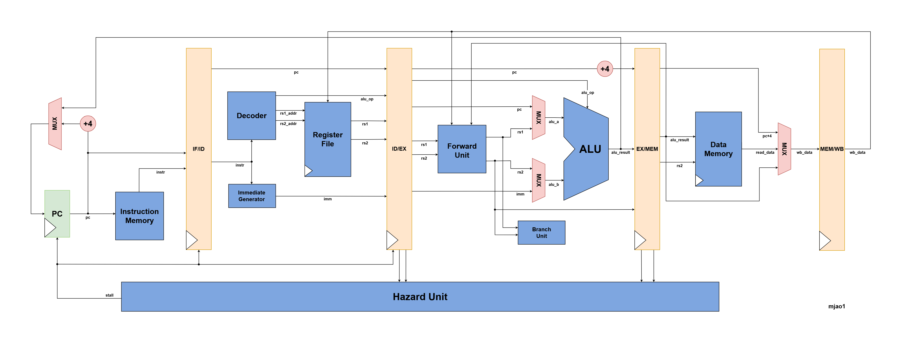

# rv32i-cpu

## Project Overview

A synthesizable 5-stage pipelined RISC-V RV32I processor in SystemVerilog, aimed at ASIC-style flows with simulation using Icarus Verilog. The core implements the main RV32I user level integer operations: ALU ops, loads/stores, branches, jumps, LUI/AUIPC, and JAL/JALR. The pipeline is complete for a classic in-order design: operand forwarding from EX/MEM and MEM/WB, hazard handling via load–use stalls, BTFNT branch prediction, and control flushes on taken branches and jumps. FENCE and SYSTEM (ECALL/EBREAK/CSR) are treated as NOPs. Instruction memory is loaded via a testbench write port or `$readmemh`, data memory is byte-addressable RAM with a configurable base address for bare metal programs. The microarchitecture design is shown below (most address and control signals are ommitted for simplicity).

<div align="center">

<p>RV32I CPU Microarchitecture</p>
</div>

## Architecture Overview

- **5-stage pipeline:** IF, ID, EX, MEM, WB with forwarding, load–use stalls, and branch/JAL flush.
- **PC:** Registered; next PC is sequential (`PC+4`), held on stall, or branch/jump target from EX.
- **Register file:** 32 × 32-bit, dual read, one write; x0 always reads as 0.
- **ALU:** Add/sub, shifts, compares, bitwise ops; shared for addresses and branch targets.
- **Memories:** Separate instruction memory (word oriented with byte-addressed load path) and data memory (little endian byte access).

## Project Structure

```
rv32i-cpu/             
├── rtl/
│   ├── alu.sv
│   ├── branch_predictor.sv
│   ├── branch_unit.sv
│   ├── data_memory.sv
│   ├── decoder.sv
│   ├── forward_unit.sv        # EX operand forwarding
│   ├── hazard_unit.sv         # Load–use stall detection
│   ├── immediate_generator.sv
│   ├── instruction_memory.sv
│   ├── register_file.sv
│   ├── rv32i_cpu.sv           # CPU top level
│   └── rv32i_pkg.sv           # Shared types (alu_op_t, branch_op_t, result_src_t)
├── sim/
│   ├── tb_rv32i_cpu.sv        # Hand encoded instruction smoke test
│   ├── tb_rv32i_cpu_c.sv      # C program loaded from memory image
│   └── tb_*.sv                # Unit testbenches
└── test/
    ├── programs/              # *.mem / *.hex images for simulation
    └── software/              # Bare metal C, linker script, Makefile
```

## RTL Implementation

### CPU and datapath

- **rv32i_cpu:** Top level; pipeline registers, forward_unit, hazard_unit, PC, instruction fetch, decode, register file, ALU, branch unit, data memory, WB to regfile.
- **forward_unit:** Selects ALU `rs1`/`rs2` from ID/EX, EX/MEM (non-load), or MEM/WB.
- **hazard_unit:** Asserts stall when a load in EX/MEM supplies a register needed by the instruction in EX.
- **decoder:** Decodes RV32I opcode/funct fields into ALU operation, source selects, reg write, mem write, branch type, and register addresses.
- **alu:** Combinational ALU (`ADD`, `SUB`, `AND`, `OR`, `XOR`, `SLT`, `SLTU`, `SLL`, `SRL`, `SRA`).
- **register_file:** 32 registers; asynchronous read, synchronous write; x0 write discarded.
- **immediate_generator:** Builds sign-extended immediates for I/S/B/U/J formats.
- **branch_unit:** Branch condition evaluation from `funct3` and comparison inputs.
- **branch_predictor:** BTFNT (Backward Taken Forward Not Taken) static branch predictor.

### Memories

- **instruction_memory:** Parameterized word array; asynchronous read by word address; synchronous write for testbench loading.
- **data_memory:** Byte-addressable RAM with synchronous write and combinational read (aligned to the CPU’s load/store path).

### Package

- **rv32i_pkg:** Opcode constants, `alu_op_t`, `branch_op_t`, `result_src_t`.

## Simulation

Run commands from the **repository root**. Outputs `sim/tb_*.vvp` are regenerated each compile.

### Top-level smoke test
```bash
iverilog -g2012 -o sim/tb_rv32i_cpu.vvp rtl/rv32i_pkg.sv sim/tb_rv32i_cpu.sv rtl/a*.sv rtl/b*.sv rtl/d*.sv rtl/f*.sv rtl/h*.sv rtl/i*.sv rtl/register_file.sv rtl/rv32i_cpu.sv && vvp sim/tb_rv32i_cpu.vvp
```

### Top-level test with compiled C
Build the bare-metal image first, then simulate:

```bash
cd test/software && make && cd ../..
iverilog -g2012 -o sim/tb_rv32i_cpu_c.vvp rtl/rv32i_pkg.sv sim/tb_rv32i_cpu_c.sv rtl/a*.sv rtl/b*.sv rtl/d*.sv rtl/f*.sv rtl/h*.sv rtl/i*.sv rtl/register_file.sv rtl/rv32i_cpu.sv && vvp sim/tb_rv32i_cpu_c.vvp
```

The C testbench checks return value in a0 (x10) against `expected_value` in `sim/tb_rv32i_cpu_c.sv`

**Toolchain:** `riscv64-unknown-elf-gcc` with `-march=rv32i -mabi=ilp32` (see `test/software/Makefile`). 

**Link map:** `.text` at `0x00000000`, RAM/stack at `0x80000000`, matching `DMEM_BASE` on `rv32i_cpu` in that testbench.

### Individual module tests

```bash
# ALU
iverilog -g2012 -o sim/tb_alu.vvp rtl/rv32i_pkg.sv rtl/alu.sv sim/tb_alu.sv && vvp sim/tb_alu.vvp

# Register file
iverilog -g2012 -o sim/tb_register_file.vvp rtl/rv32i_pkg.sv rtl/register_file.sv sim/tb_register_file.sv && vvp sim/tb_register_file.vvp

# Immediate generator
iverilog -g2012 -o sim/tb_immediate_generator.vvp rtl/rv32i_pkg.sv rtl/immediate_generator.sv sim/tb_immediate_generator.sv && vvp sim/tb_immediate_generator.vvp

# Branch unit
iverilog -g2012 -o sim/tb_branch_unit.vvp rtl/rv32i_pkg.sv rtl/branch_unit.sv sim/tb_branch_unit.sv && vvp sim/tb_branch_unit.vvp

# Decoder
iverilog -g2012 -o sim/tb_decoder.vvp rtl/rv32i_pkg.sv rtl/decoder.sv sim/tb_decoder.sv && vvp sim/tb_decoder.vvp

# Instruction memory
iverilog -g2012 -o sim/tb_instruction_memory.vvp rtl/instruction_memory.sv sim/tb_instruction_memory.sv && vvp sim/tb_instruction_memory.vvp

# Data memory
iverilog -g2012 -o sim/tb_data_memory.vvp rtl/data_memory.sv sim/tb_data_memory.sv && vvp sim/tb_data_memory.vvp

# Forward unit
iverilog -g2012 -o sim/tb_forward_unit.vvp rtl/rv32i_pkg.sv rtl/forward_unit.sv sim/tb_forward_unit.sv && vvp sim/tb_forward_unit.vvp

# Hazard unit
iverilog -g2012 -o sim/tb_hazard_unit.vvp rtl/rv32i_pkg.sv rtl/hazard_unit.sv sim/tb_hazard_unit.sv && vvp sim/tb_hazard_unit.vvp
```

### Case specific tests
```bash
# Load-use hazard
iverilog -g2012 -o sim/tb_load_use_hazard.vvp rtl/rv32i_pkg.sv sim/tb_load_use_hazard.sv rtl/a*.sv rtl/b*.sv rtl/d*.sv rtl/f*.sv rtl/h*.sv rtl/i*.sv rtl/register_file.sv rtl/rv32i_cpu.sv && vvp sim/tb_load_use_hazard.vvp

# Branch cycle count benchmark (current: 227)
iverilog -g2012 -o sim/tb_branch_benchmark.vvp rtl/rv32i_pkg.sv rtl/alu.sv rtl/register_file.sv rtl/data_memory.sv rtl/instruction_memory.sv rtl/decoder.sv rtl/immediate_generator.sv rtl/branch_unit.sv rtl/branch_predictor.sv rtl/forward_unit.sv rtl/hazard_unit.sv rtl/rv32i_cpu.sv sim/tb_branch_benchmark.sv && vvp sim/tb_branch_benchmark.vvp
```

## Synthesis

```bash
yosys synth.ys
```

Output: `synth_rv32i_top.v`
